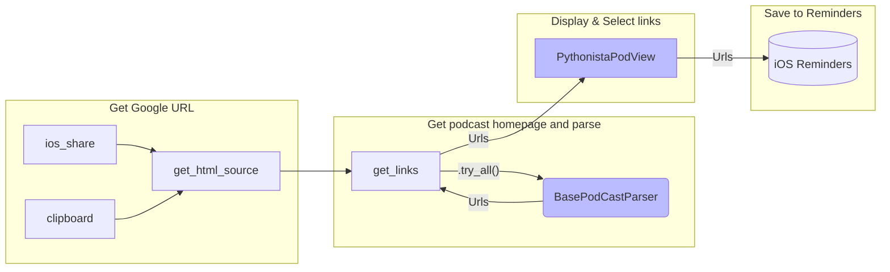
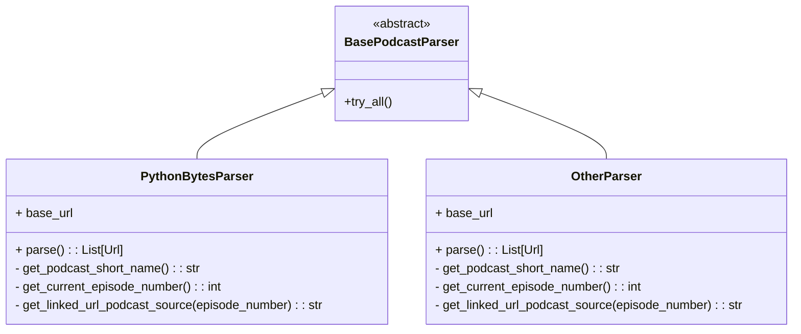

# Memocast

A small [iOS](https://en.wikipedia.org/wiki/IOS) application for e.g. iPhone that allow you to add links heard in podcasts into [reminders](https://en.wikipedia.org/wiki/Reminders_(Apple)).

## Motivation

Imagine that you just as I often do listening to a podcast such as [PythonBytes](https://podcasts.google.com/feed/aHR0cHM6Ly9weXRob25ieXRlcy5mbS9lcGlzb2Rlcy9yc3M/episode/NTI2OTQ0YjEtNDhjZS00OTllLWE3YTAtZThiZWU2MzdlMTMy?sa=X&ved=0CAwQz4EHahcKEwjgm5v-qov-AhUAAAAAHQAAAAAQCg) (a fantastic one) using [Google Podcast](https://podcasts.google.com/) while out walking and hear a talk about an interesting project or article you wish to read more about when time allow.
Thankfully the referenced links are added to the show notes of the talk, but it means you would need to look it up and add this into your own notes.

Wouldn't be nice if there was an easier way select which of those you found interesting and have them added to reminders on your phone while you'd still out walking without the need to lose too much focus on where you put your feets..?

... if you do recognise the same, then this small application might be what you're looking for.


## How to use

Once you've listened to your podcast using Google podcaster you click "share" and run this within Pythonista.
This will allow you select the links you wish to add to your Reminders app for later use.


## Currently supported podcast parsers

- [PythonBytes](https://pythonbytes.fm/)
- [Talk Python To Me](https://talkpython.fm/)
- [Real Python](https://realpython.com/podcasts/)


## Requirements and installation

To allow Python to run within your device you will need to first to install [Pythonista 3](https://apps.apple.com/us/app/pythonista-3/id1085978097) from app store that by the time writing this costs $9.99 which to my opinion is a very small price for such useful addition to your device.

Either click on this link or aim your camera at the below QR-code to have it downloaded to your device.


## How to develop additional podcast parser

### Create the code

All that is needed need to do is to create a new python file within the parsers package...

```
📦 memocast-project
┣ 📂 memocast
┃ ┣ 📜 ...
┃ ┗ 📂 parsers
┃   ┣ 📜 __init__.py
┃   ┣ 📜 baseclass.py
┃   ┣ 📜 pythonbytes.py
┃   ┗ 📜 otherpodcast.py  ✨🆕
```

... let's pretend we wish to add a new one named `otherpodcast.py` and within this we assure we create a new class and inherit from `BasePodCastParser` that will allow the application to dynamically use this new one as a plugin.

```python
# memocast/parsers/otherpodcast.py

from typing import Iterable
from bs4 import BeautifulSoup  # Most likely to be used for parsing HTML
from memocast.logging_ import logger  # Logging singleton
from .. import io_  # Module with e.g. convinient download_html(episode_url)
from .. import protocols  # Includes dataclass Url
from .baseclass import BasePodcastParser  # Inherit from this baseclass


class OtherParser(BasePodcastParser):
  	# This is the URL of which this podcast has its links available
    base_url = 'https://.....'  

    @staticmethod
    def get_podcast_short_name() -> str:
        return "OtherPodCast"  # This is used as part of the links shown in Reminders

   def get_current_episode_number(self) -> int:
    # This should return the episode number from Google Podcasts URL
    example_episode_number = 134
    return example_episodr_number
      
    def parse(self) -> Iterable[protocols.Url]:
      # This is the main method to do the work
      episode_source_html = io_.download('https://....')  # Example
      bs = BeautifulSoup(episode_source_html, 'html.parser')
        urls = [
          protocols.Url(url='http://foo.com', 'Project Foo', self)
          protocols.Url(url='http://bar.com', 'Project Bar', self)
        ]  # Obviously this should be dynamically created by your code
        return urls  # Return a list of URLs
```

By adding this module it will work as a plugin and allow the application to use this to attempt parsing.

### Test your code

To manually test your parser you can also do that using your regular working environment (MacOS/Windows/Linux) by copying the URL to your clipboard since it use this as fallback. Currently the user interface and "Reminders" is only support by iOS the application will exit before then - but for most cases enough to test your parser.

As with good best practice you may consider creating unit tests ([pytest](https://docs.pytest.org/)) within the `tests` folder.

### My development workflow

What I did discover and made the development experience so smooth is the fact that as long as you have a Mac with a [silicon processor](https://support.apple.com/en-us/HT211814) you are apple to install and run Pythonista as [iOS app within MacOS](https://developer.apple.com/documentation/apple-silicon/running-your-ios-apps-in-macos).

So what I did was to create a within the *Pythonista* folder in [iCloud drive](https://support.apple.com/guide/iphone/set-up-icloud-drive-iphbbcf8827d/ios), and then I also assured I had this folder under version control using a git-repository and using the iOS app [Working Copy](https://apps.apple.com/us/app/working-copy-git-client/id896694807) as git client on the devices.

Now this iCloud folder that you can have kept synced with your MacOS is found available within
`Library/Mobile Documents/iCloud~com~omz-software~Pythonista3/Documents`
so that way you can access it either from your favorite IDE on your Mac or from Pythonista from you iOS devices.


## Software design

### Sequence flowchart

Essentially in sequence the application does ..

- Get URL for the Google podcast
- The `BasePodCastParser` sequentially test all parsers
  - If multiple parsers matching give user a choice to select correct
- The list of all links (URLs) with descriptions displayed to user for selection
- Selected links stored to iOS Reminders




### Class diagram for parsers

For further development this is the the only class of relevance to extend with additional parsers




## Credits to .. 

- Developers of [Pythonista](http://omz-software.com/pythonista/)
- [JeRequests](https://pypi.org/project/requests/)
- [Beautifulsoup4](https://pypi.org/project/beautifulsoup4/)
- Hosts of [PythonBytes](https://talkpython.fm/), [Talk Python To Me](https://talkpython.fm/) and [RealPython](https://realpython.com/podcasts/)
- Jetbrains for remarkable [PyCharm](https://www.jetbrains.com/pycharm/)