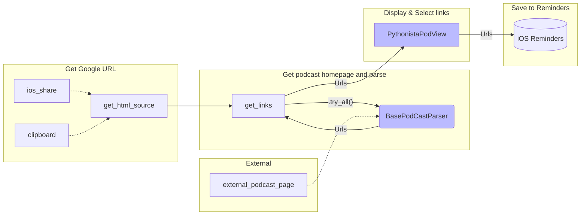
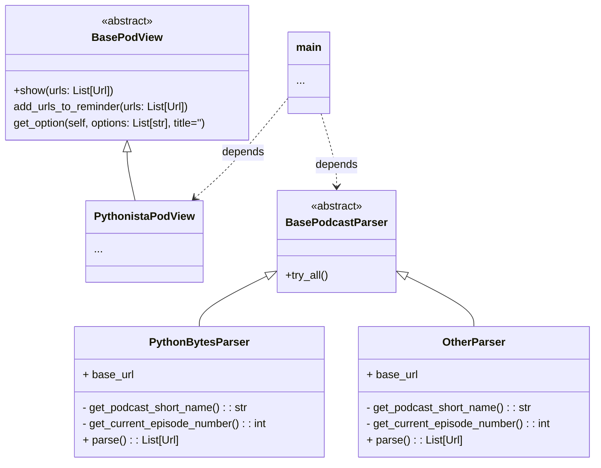

# Memocast 📻 ✅

A small [iOS](https://en.wikipedia.org/wiki/IOS) app for e.g. iPhone that allow you to add links heard in podcasts into [reminders](https://en.wikipedia.org/wiki/Reminders_(Apple)).

## Motivation 🤔

Imagine that you just as I often do listening to a podcast such as [PythonBytes](https://podcasts.google.com/feed/aHR0cHM6Ly9weXRob25ieXRlcy5mbS9lcGlzb2Rlcy9yc3M/episode/NTI2OTQ0YjEtNDhjZS00OTllLWE3YTAtZThiZWU2MzdlMTMy?sa=X&ved=0CAwQz4EHahcKEwjgm5v-qov-AhUAAAAAHQAAAAAQCg) *(a fantastic one btw)* using [Google Podcast](https://podcasts.google.com/) while out walking and hear a talk about an interesting project or article you wish to read more about when time allow. 

Thankfully the referenced links are added to the show notes of the talk, but it means you would usually need to look it up on the podcasts main page and add this into your own personal notes, and using the phone to *copy-and-paste* is found tedious.

Wouldn't it be nice if there was an easier way select which of those you found interesting and have them added to reminders on your phone while you'd still out walking without the need to lose too much of your focus on where you put your feets..?

... if you also see this as a problem and wished there were a better way, then this small app might be what you're searching for.


## How to use 👨🏼‍🏫📱

|                                                              |                                                              |
| ------------------------------------------------------------ | ------------------------------------------------------------ |
| Once you've listened to your podcast using Google podcaster you click "share" and "Run Pythonista script"<br/>You will then have a MemoCast icon, click this and it will allow you select the links you wish to add to your Reminders app for later use. |  |


## Currently supported podcasts 🎧

So currently the following podcasts are currently supported by the parsers that does the work of finding links and allow one to add to your reminders, but easily extended in the futurue ... see further down how ...

- [PythonBytes](https://pythonbytes.fm/)
- [Talk Python To Me](https://talkpython.fm/)
- [Real Python](https://realpython.com/podcasts/)


## Installation ✓

**Step 1)** Install [Pythonista 3](https://www.google.com/url?sa=t&rct=j&q=&esrc=s&source=web&cd=&cad=rja&uact=8&ved=2ahUKEwjPwrakjKz-AhXis4sKHXEqAwgQFnoECCAQAQ&url=https%3A%2F%2Fapps.apple.com%2Fus%2Fapp%2Fpythonista-3%2Fid1085978097&usg=AOvVaw3bRq2p9kAOLiy2adnnJViz) from app store

**Step 2)** Either download and run this [install.py](https://raw.githubusercontent.com/engdan77/memocast/master/install.py) script within Pythonista on your iPhone/iPad or aim your camera at the below **QR-code** and open this link.

  

**Step 3)** Click **<u>Run</u>** in the upper right corner.

**Step 4)** Open up Pyhonista ➡ Script Library ➡ This Phone ➡ memocast-master ➡ app.py

**Step 5)** Click on the wrench 🔧 in the upper right ➡ Shortcuts ➡ Share Extension ➡ Click on **+** icon

**Step 6)** Change custom title to "MemoCast" ➡ click **<u>Add</u>**


## Develop support for additional podcasts

### Create the code

All that is needed need to do is to create a new python file within the parsers package...

```
📦 memocast-project
┣ 📂 memocast
┃ ┣ 📜 ...
┃ ┗ 📂 parsers
┃   ┣ 📜 __init__.py
┃   ┣ 📜 baseclass.py
┃   ┣ 📜 pythonbytes.py
┃   ┗ 📜 otherpodcast.py  ✨🆕
```

... let's pretend we wish to add a new one named `otherpodcast.py` and within this we assure we create a new class and inherit from `BasePodCastParser` that will allow the application to dynamically use this new one as a plugin.

```python
# memocast/parsers/otherpodcast.py

from typing import Iterable
from bs4 import BeautifulSoup  # Most likely to be used for parsing HTML
from memocast.logging_ import logger  # Custom logging singleton class
from .. import io_  # Module with e.g. convinient download_html(episode_url)
from .. import protocols  # Includes dataclass Url
from .baseclass import BasePodcastParser  # Inherit from this baseclass


class OtherParser(BasePodcastParser):
  	# This is the URL of which this podcast has its links available
    base_url = 'https://.....'  

    @staticmethod
    def get_podcast_short_name() -> str:
        return "OtherPodCast"  # This is used as part of the links shown in Reminders

   def get_current_episode_number(self) -> int:
    # This should return the episode number from Google Podcasts URL
    example_episode_number = 134
    return example_episodr_number
      
    def parse(self) -> Iterable[protocols.Url]:
      # This is the main method to do the work
      episode_source_html = io_.download('https://....')  # Example
      bs = BeautifulSoup(episode_source_html, 'html.parser')
        static_example_urls = [
          protocols.Url(url='http://foo.com', description='Project Foo', parser=self)
          protocols.Url(url='http://bar.com', description='Project Bar', parser=self)
        ]  # Obviously this should be dynamically created by your code
        return static_example_urls  # Return a list of URLs
```

By adding this module it will work as a *<u>plugin</u>* and will automatically be used by the app.

### Test your code

To manually test your parser you can also do that using your regular working environment (MacOS/Windows/Linux) by copying the URL to your clipboard since it use this as fallback. Currently the user interface and "Reminders" is only support by iOS the application will exit before then - but for most cases enough to test your parser.

As with good best practice you may consider creating unit tests ([pytest](https://docs.pytest.org/)) within the `tests` folder.


## My development workflow and reflections using Pythonista 👨🏼‍💻

My past experience developing apps for iOS using Python have been that it have added a lot of overhead using framework such as [Kivy](https://kivy.org/) that have involved setting up certain tool chain including XCode and required one to compile such into an [.ipa](https://en.wikipedia.org/wiki/.ipa) file that also required a complex procedure for signing and/or apply other strategy to allow other users to take advantage of your app that often came with a price (at least at that time). But such project were eventually made such as [this](https://github.com/engdan77/otis_app) one.

When I stumbled on Pythonista 3 it crossed me how easy it was to get an "app" running with minimal efforts and does expose the most relevant iOS API's such as accessing part of it you wouldn't easily do using other frameworks and it does have a rich set of packages included from start such as those found [here](https://omz-software.com/pythonista/docs/ios/index.html) which is quite astonishing. And have yet only started to scratch the surface. 😀👍

And all that is needed is to share your Python code that also could be done sharing as an URL (at least small scripts) that makes it relatively easy to share your project.

Pythonista 3 comes with a one-time price, but a fairly low one so I would not think it would frighten others

Also what I did discover and made the development experience so smooth is the fact that as long as you have a Mac with a [silicon processor](https://support.apple.com/en-us/HT211814) you are apple to install and run Pythonista as [iOS app within MacOS](https://developer.apple.com/documentation/apple-silicon/running-your-ios-apps-in-macos) and continue developing using your favorite IDE (such as PyCharm) and interchangable run within Pythonista on your computer as found needed (acting as an "emulator").

So what I did was to create *<u>project</u>* folder within the *Pythonista* created in the [iCloud drive](https://support.apple.com/guide/iphone/set-up-icloud-drive-iphbbcf8827d/ios), and then I also assured I had this folder under version control using a git-repository and using the iOS app [Working Copy](https://apps.apple.com/us/app/working-copy-git-client/id896694807) as git client on the devices.

Now this iCloud folder that you can have kept synced with your MacOS is found available within
`Library/Mobile Documents/iCloud~com~omz-software~Pythonista3/Documents`
so that way you can access it either from your favorite IDE on your Mac or from Pythonista from you iOS devices.

For me at least this satisifed my main needs... 🙌

## Software design

### High Level Design 🚁

Essentially in sequence the application does ..

- Get URL for the Google podcast
- The `BasePodCastParser` sequentially test all parsers
  - If multiple parsers matching give user a choice to select correct
- The list of all links (URLs) with descriptions displayed to user for selection
- Selected links stored to iOS Reminders




### Class diagram over main pieces 🧩

For further development this is the the only class of relevance to extend with additional parsers



## Contributions 🫶

This is a project in a very early stage and any contributions are more than welcome by submitting [pull request](https://docs.github.com/en/pull-requests/collaborating-with-pull-requests/proposing-changes-to-your-work-with-pull-requests/about-pull-requests) for the repository https://github.com/engdan77/memocast since it may still have some rough edges. And new "parsers" (see above) is found valuable.

## ✨ Credits goes to ..

- Developers of [Pythonista](http://omz-software.com/pythonista/) for such great app making life easiers
- Maintainers of [Requests](https://pypi.org/project/requests/), [Beautifulsoup4](https://pypi.org/project/beautifulsoup4/) making this app possible
- Hosts of [PythonBytes](https://talkpython.fm/), [Talk Python To Me](https://talkpython.fm/) and [RealPython](https://realpython.com/podcasts/) for fantastic talks
- Jetbrains for remarkable [PyCharm](https://www.jetbrains.com/pycharm/)